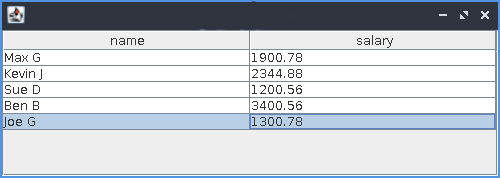

# Motto

Motto is a programmable platform for data analysis.

#### Features

 - Multiple data sources and sinks - RDBMS, CSV/JSON/XML files, HTTP APIs etc.
 - A simple and expressive functional language for data analysis.
 - Built-in statistical and visualization functions.
 - High-performance immutable data structures - lists, sets, dictionaries, tables.
 - Support for parallel and distributed computing.
 - Integrates seamlessly with the Java ecosystem.

### Getting Started

Make sure you have JDK 10 or later installed. You can build and run `Motto` with the following commands:

```
$ make
$ java -jar target/motto-<version>-standalone.jar
```

This will land you in the REPL, where you can play with the platform:

```
motto v0.0.1
?
```

The `?` prompt shows that Motto is waiting for your input.

It is suggested that you work through the following short tutorial and then
proceed to the rest of the [Documentation](docs/index.md).

### A 5-minute Tutorial

In this short tutorial, let's create and manipulate a database for managing employee salaries.
A columnar-table is one of the basic structures used by Motto. This format makes it easy and efficient to
write functions that aggregate values in individual columns.

We use the `tab` function to manually create a table:

```lisp
? emp:tab(['name 'salary]
          [["Max G" "Kevin J" "Sue D" "Ben B" "Joe G"]
           [1900.78 2344.88 1200.56 3400.56 1300.78]])
```

The first argument is a list of column names. We have two symbolic names here: `'name` and `'salary`.
The second argument is a list of lists. Each list is the values for each column.
Let's have a look at the table now:

```lisp
? emp

; name: [Max G Kevin J Sue D Ben B Joe G]
; salary: [1900.78 2344.88 1200.56 3400.56 1300.78]
```

**Note** In this tutorial, the output from Motto will be identified by a semi-colon (;).
This is not part of the output produced by the real REPL.

Here is a quick "statistical" summary of the table:

```lisp
? summary(emp)

; [[col:name count:0 is_numeric:0b Joe_G:1 Ben_B:1 Sue_D:1 Kevin_J:1 Max_G:1]
;  [col:salary min:1200.56 max:3400.56 mean:2029.512 median:1900.78 is_numeric:1b]]
```

We may also get graphical views of our data, in spreadsheet format or as a chart:

```lisp
? view(emp)
```


```lisp
? chart('bar emp('name) emp('salary))
```


If you want to, you can just `flip` a table to a record based format.

```lisp
? flip(emp)

;    name  salary
; ---------------------------
;    Max G 1900.78
;  Kevin J 2344.88
;    Sue D 1200.56
;    Ben B 3400.56
;    Joe G 1300.78

? flip(flip(emp))

; name: [Max G Kevin J Sue D Ben B Joe G]
; salary: [1900.78 2344.88 1200.56 3400.56 1300.78]
```

Record-based tables might be the ideal structure for
some operations, but in this tutorial we only work with columnar data.

Let's write a function to compute a given percentage of each salary:

```lisp
? sals:emp('salary)
? incr:fn(percent) map(fn(s) s * percent, sals)
```

We can use this function to give a 10% salary increment to all employees:

```lisp
? incr(0.1) + sals

; [2090.858 2579.368 1320.616 3740.616 1430.858]
```

How much salary increase is allotted to each employee?

```lisp
? (incr(0.1) + sals) - sals

; [190.078 234.48 120.05 340.05 130.077]
```

What is the total additional cost incurred to the company by the salary increase?

```lisp
? sum((incr(0.1) + sals) - sals)

; 1014.75
```

That concludes our very short tutorial!
To learn more, please go the [detailed documentation](docs/index.md).

### Scripts & Compilation

Motto source files usually have the extension `.m`.
Source files can be loaded into the interpreter by invoking the `ld` command.
It is customary to call `ld` without the `.m` extension.

For instance, if you have a script called "abc.m", it can be loaded as:

```
? ld "abc"
```

`ld` will take care of compiling the script into object code, if the object code
file (with extension `.mo`) is not found.

A script can be explicitly compiled into a `.mo` file by calling the `cf` (compile-file) function:

```
? cf("abc")
```

The object code is compiled on-the-fly to JVM byte code.