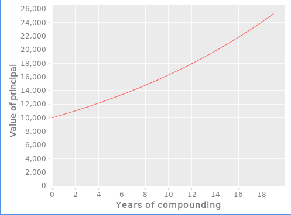

# Visualizing Return on Investment

The following program shows how to graphically view the projected returns from an investment
over 10 years:

```lisp
investment: 10000
rate: 0.08
years: 10
returns: (^X1 + X1 * rate) @~ repeat(years investment)

plot('xy til(years) returns ['xlabel: "Years" 'ylabel: "Returns"])
```

The `plot` function will produce the following chart on screen:



[Back](sample.md)