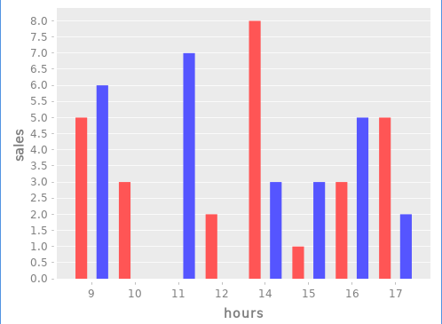
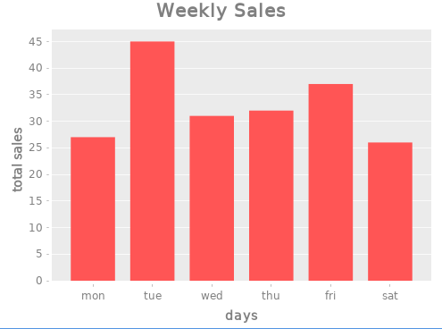

# Weekly Sales Analysis

Weekly sales for each hour of the working-day:

```sml
total_by_hr:[[5 3 0 2 8 1 3 5]
               [9 3 9 8 1 3 9 3]
               [4 0 6 6 5 4 0 6]
               [4 8 7 2 8 1 0 2]
               [4 8 6 1 4 3 5 6]
               [6 0 7 0 3 3 5 2]]
```

Cumulative totals and total sales:

```lisp
sums ~ total_by_hr
; [[5 8 8 10 18 19 22 27]
;  [9 12 21 29 30 33 42 45]
;  [4 4 10 16 21 25 25 31]
;  [4 12 19 21 29 30 30 32]
;  [4 12 18 19 23 26 31 37]
;  [6 6 13 13 16 19 24 26]]

sum ~ total_by_hr
; [27 45 31 32 37 26]

sum(sum ~ total_by_hr)
; 198
```

Average sale for each day and average of total sales:

```lisp
mean ~ total_by_hr
; [3.375 5.625 3.875 4.000 4.625 3.250]

mean(mean ~ total_by_hr)
; 4.125
```

Visualize the data:

```sml
c:chart('bar hrs first(total_by_hr) ['xlabel:"hours" 'ylabel:"sales"])
(fn(x) plot_add(c 'categories hrs x)) ~ rest(total_by_hr)
view(c)
```



```sml
chart('bar ['mon 'tue 'wed 'thu 'fri 'sat], sum ~ total_by_hr,
        ['title:"Weekly Sales" 'xlabel:"days" 'ylabel:"total sales"])
```

