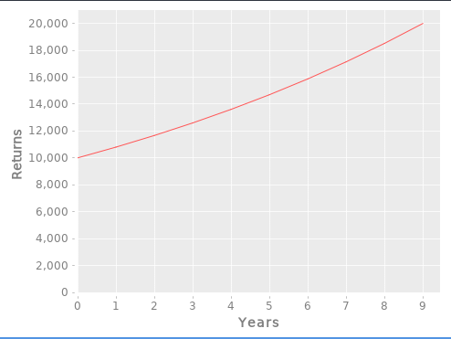

# Statistics and Visualizations

Visual aids are an excellent means for communicating information.

Motto has built-in visualization facilities that enable you to present
results of data analysis in an appealing manner.

The following program shows how to graphically view the projected returns from an investment
over 10 years:

```lisp
investment: 10000
rate: 0.08
years: 10
returns: (^X1 + X1 * rate) @~ repeat(years investment)

plot('xy til(years) returns ['xlabel: "Years" 'ylabel: "Returns"])
```

The `plot` function will produce the following chart on screen:



;; TODO